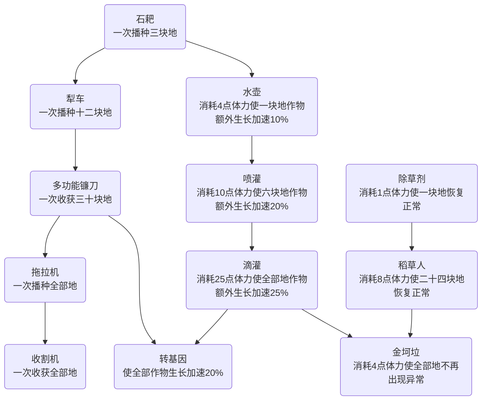
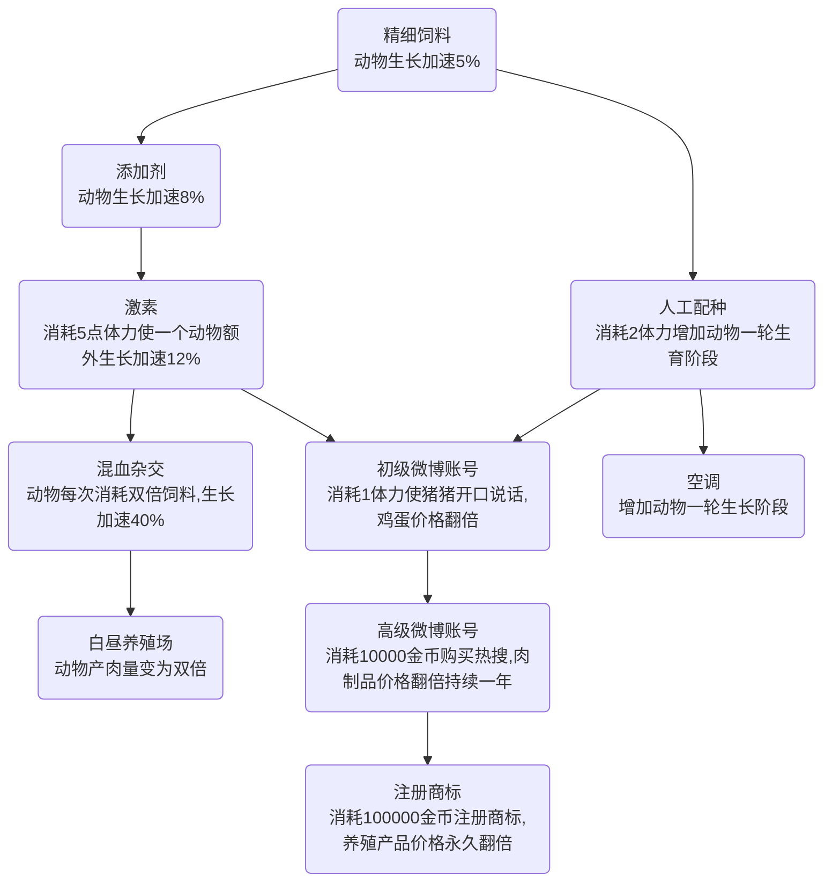
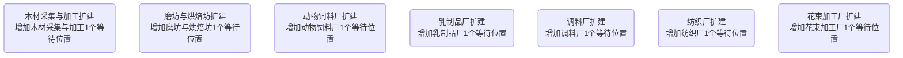
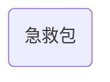

##经营农场

### 完成度

1. 作物 OK
2. 工厂 OK
3. 等级 OK
4. 动物 OK
5. 贸易 OK
6. 池塘
7. 果园
8. 花园
9. 赌场
10. 矿山
11. 高塔
12. 限时

### 产品大全

####作物
1. 小麦
2. 玉米
3. 萝卜
4. 大豆
5. 甘蔗
6. 棉花
7. 土豆
8. 辣椒
9. 南瓜
10. 番茄
11. 西瓜
12. 花生
13. 茶叶

####动物
1. 鸡
2. 牛
3. 猪
4. 羊
5. 鸭

####池塘
1. 鱼
2. 虾
3. 蟹
4. 贝

####果树

1. 苹果
2. 桃子
3. 柠檬
4. 香蕉
5. 樱桃
6. 葡萄
7. 可可
8. 咖啡
9. 橡胶

####花卉

1. 狗尾草
2. 蒲公英
3. 玫瑰
4. 兰花
5. 郁金香
6. 薰衣草
7. 茉莉
8. 金银花

####加工厂

1. 木材采集与加工
   1. 木柴
   2. 木棚
   3. 锄头
   4. 木板
   5. 纸
   6. 木筏

2. 磨坊与烘焙坊
   1. 面粉
   2. 面包
   3. 饼干
   4. 泡芙
   5. 蛋糕
   6. 披萨
   7. 土豆粉
   8. 水果馅饼

3. 动物饲料厂
   1. 鸡饲料
   2. 牛饲料
   3. 猪饲料
   4. 羊饲料
   5. 鸭饲料

4. 乳制品厂
   1. 奶油
   2. 奶酪
   3. 黄油
   4. 沙拉酱
   5. 酸奶

5. 调料厂
   1. 醋
   2. 酱油
   3. 白糖
   4. 糖浆
   5. 辣酱
   6. 番茄酱
   7. 花生酱

6. 纺织厂
   1. 棉布
   2. 毛线
   3. 绷带
   4. 织布
   5. 丝绸
   6. 渔网

7. 花束加工厂
   1. 玫瑰束
   2. 盆栽
   3. 混合花束
   4. 香水
   5. 金银花瓣

8. 服装厂
   1. 衬衣
   2. 毛衣
   3. 布鞋
   4. 西装
   5. 羽绒服
   6. 运动鞋
   7. 晚礼服
   8. 背包
   9. 铠甲
   10. 头盔

9. 建筑工厂
   1. 石块
   2. 平房
   3. 别墅
   4. 砂砾
   5. 凉亭
   6. 沥青
   7. 公园
   8. 公寓

10. 熟食品加工厂
   1. 培根
   2. 牛排
   3. 爆米花
   4. 巧克力
   5. 冰淇淋
   6. 鲜果捞

11. 装饰品作坊
    1. 南瓜灯
    2. 拱门
    3. 花篮
    4. 圣诞树
    5. 雕像

12. 饮料厂
    1. 啤酒
    2. 柠檬水
    3. 混合果汁
    4. 西瓜汁
    5. 美式咖啡
    6. 奶茶

13. 重工业加工厂
    1. 煤炭
    2. 塑料
    3. 铁锭
    4. 金刚石
    5. 金条
    6. 火箭

14. 军工厂
    1. 匕首
    2. 弓箭
    3. 手雷
    4. 手枪
    5. 冲锋枪
    6. 意大利炮
    7. 坦克 
    8. 飞行器

15. 首饰作坊
    1. 钻石戒指
    2. 项链
    3. 手镯
    4. 耳环
    5. 金钗

### 升级顺序

1. 作物-小麦 加工厂-木柴
2. 作物-玉米 加工厂-面粉
3. 加工厂-木棚 加工厂-面包
4. 动物-鸡 加工厂-鸡饲料
5. 加工厂-锄头 加工厂-饼干
6. 动物-牛 加工厂-牛饲料
7. 加工厂-奶油 加工厂-泡芙
8. 作物-萝卜 加工厂-奶酪
9. 动物-猪 加工厂-猪饲料
10. 作物-大豆 加工厂-醋
11. 作物-甘蔗 加工厂-酱油
12. 加工厂-黄油 加工厂-白糖
13. 作物-棉花 加工厂-蛋糕
14. 加工厂-披萨 加工厂-棉布
15. 作物-土豆 池塘-鱼
16. 果树-苹果 加工厂-土豆粉
17. 作物-辣椒 加工厂-糖浆
18. 花卉-狗尾草 加工厂-辣酱
19. 果树-桃子 花卉-蒲公英
20. 动物-羊 加工厂-羊饲料
21. 果树-柠檬 加工厂-毛线
22. 池塘-虾 加工厂-毛衣
23. 花卉-玫瑰 加工厂-玫瑰束
24. 果树-香蕉 加工厂-衬衣
25. 花卉-兰花 加工厂-盆栽
26. 加工厂-绷带 加工厂-石块
27. 果树-樱桃 加工厂-布鞋
28. 果树-葡萄 花卉-郁金香
29. 加工厂-培根 花卉-薰衣草
30. 作物-南瓜 池塘-蟹
31. 加工厂-平房 加工厂-南瓜灯
32. 作物-番茄 加工厂-混合花束
33. 加工厂-番茄酱 加工厂-牛排
34. 加工厂-沙拉酱 加工厂-织布
35. 加工厂-西装 加工厂-别墅
36. 加工厂-啤酒 加工厂-拱门
37. 果树-可可 加工厂-爆米花
38. 加工厂-砂砾 加工厂-巧克力
39. 加工厂-柠檬水 加工厂-煤炭
40. 花卉-茉莉 加工厂-花篮
41. 加工厂-木板 加工厂-混合果汁 加工厂-塑料
42. 加工厂-凉亭 加工厂-香水 加工厂-铁锭
43. 作物-西瓜 加工厂-纸 加工厂-匕首
44. 动物-鸭 加工厂-西瓜汁 加工厂-鸭饲料
45. 加工厂-金刚石 加工厂-羽绒服 加工厂-水果馅饼
46. 作物-花生 加工厂-钻戒 加工厂-弓箭
47. 作物-咖啡 加工厂-花生酱 加工厂-圣诞树
48. 加工厂-沥青 加工厂-手雷 加工厂-美式咖啡
49. 加工厂-酸奶 加工厂-丝绸 加工厂-冰淇淋
50. 作物-茶叶 加工厂-渔网 加工厂-鲜果捞
51. 加工厂-木筏 加工厂-雕像 加工厂-奶茶
52. 果树-橡胶 花卉-金银花 加工厂-金银花瓣
53. 池塘-贝 加工厂-手枪 加工厂-运动鞋
54. 加工厂-晚礼服 加工厂-冲锋枪 加工厂-项链
55. 加工厂-背包 加工厂-公园 加工厂-意大利炮
56. 加工厂-手镯 加工厂-金条
57. 加工厂-铠甲 加工厂-公寓
58. 加工厂-耳环 加工厂-头盔
59. 加工厂-坦克 加工厂-金钗
60. 加工厂-飞行器 加工厂-火箭

####实验室

#### 

#### 

#### 

