# 18 Foever

## 梗概

### 主线

#### 发展

#### 军队

#### 修炼

#### 家园

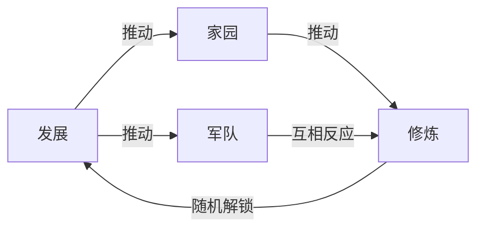

### 时代

#### 石器时代

#### 青铜器时代

#### 农牧时代

#### 前封建时代

#### 后封建时代

#### 工业时代

#### 电气时代

#### 信息时代

#### 未来时代

### 伟人（发展）

通过科举考试随机出现，提升发展研究速度

#### 数学家

欧几里得

刘徽

祖冲之

斐波那契

笛卡尔

费马

欧拉

高斯

陈省身

华罗庚

陈景润

丘成桐

#### 物理学家

阿基米德

墨子

张衡

沈括

牛顿

法拉第

爱因斯坦

薛定谔

钱学森

王淦昌

杨振宁

#### 化学家

孙思邈

葛洪

拉瓦锡

李比希

巴斯德

诺贝尔

门捷列夫

卢瑟福

侯德榜

陈光旭

#### 生物学家

华佗

李时珍

贾思勰

宋应星

施旺

孟德尔

摩尔根

沃森

克里克

袁隆平

屠呦呦

钟南山

#### 地理学家

郦道元

魏源

徐霞客

裴秀

麦哲伦

哥伦布

竺可桢

葛剑雄

任美锷

#### 天文学家

石申

郭守敬

哥白尼

伽利略

开普勒

哈勃

叶叔华

杨海成

#### 工程师

鲁班

毕昇

杨广

埃菲尔

梁思成

冯纪忠

布劳恩

郑守仁

吴良镛

#### 程序员

冯诺依曼

香农

图灵

林纳斯

乔布斯

比尔盖茨

扎克伯格

雷军

#### 政治家

凯撒

嬴政

王安石

俾斯麦

林肯

列宁

袁世凯

斯大林

周恩来

奥巴马

#### 历史学家

司马迁

伏尔泰

梁启超

钱穆

易中天

王立群

#### 金融学家

张骞

马可波罗

亚当斯密

李嘉图

马歇尔

巴菲特

#### 语言学家

荀子

沈重

宋濂

顾炎武

王筠

叶圣陶

季羡林

#### 文学家

老子

屈原

陶渊明

莎士比亚

李白

苏轼

蒲松龄

高尔基

雨果

欧亨利

鲁迅

#### 音乐家

伯牙

李延年

嵇康

马致远

巴赫

莫扎特

贝多芬

肖邦

冼星海

邓丽君

周杰伦

#### 艺术家

顾恺之

王羲之

欧阳询

颜真卿

黄庭坚

仇英

郑板桥

达芬奇

梵高

莫奈

徐悲鸿

### 伟人（军事）

通过科举考试随机出现，提升作战单位属性

#### 步兵指挥官

#### 骑兵指挥官

#### 炮兵指挥官

#### 海军指挥官

#### 空军指挥官

#### 阵地指挥官

亚历山大（121002）

凯撒（310002）

图拉真（111004）

君士坦丁（230001）

项羽（123000）

田忌（250000）

孙膑（400004）

刘邦（331000）

吕布（510001）

曹仁（111301）

张辽（140100）

张飞（440000）

关羽（150002）

诸葛亮（104113）

陆逊（113300）

萨拉丁（022005）

克伦威尔（052000）

李密

王玄策

岳飞

郑和

穆罕默德

李自成

郑成功

拿破仑

左宗棠

李鸿章

彭德怀

朱德

粟裕

戈林

隆美尔

古德利安

蒙哥马利

朱可夫

麦克阿瑟

艾森豪威尔

尼米茨

巴顿

林彪

### 伟人（修炼）

通过运行星盘显示位置，提供武技或兵器

#### 金

后羿（兵器：逐日弓）

蓐收（武技：披甲龙归）

麒麟（武技：青麟手）

雷震子（兵器：黄金杖）

许逊（武技：点石成金）

#### 木

神农（兵器：百草典）

句芒（武技：木森林变换）

白虎（武技：剑齿锋合）

姬昌（兵器：黄铜钺）

朱由校（武技：万木成形）

#### 水

伏羲（兵器：伏羲九针）

共工（武技：天降春雨）

青龙（武技：潮魂玄月）

妲己（兵器：蛇图腾）

李冰（武技：都江奔流）

#### 火

蚩尤（兵器：火炎戈）

祝融（武技：狂火拳）

朱雀（武技：凤凰涅槃）

哪吒（兵器：混天绫）

周瑜（武技：业炎）

#### 土

轩辕（兵器：轩辕剑）

精卫（武技：千矢）

玄武（武技：斗转七星）

土行孙（兵器：镔铁棍）

白起（武技：扬尘）

## 发展

### 发展树

#### 自然科学

##### 数学

##### 物理

##### 化学

##### 生物

##### 地理

##### 天文

##### 建筑

##### 计算机

##### 金融

#### 人文科学

##### 政法

##### 历史

##### 语言

##### 文学

##### 音乐

##### 美术

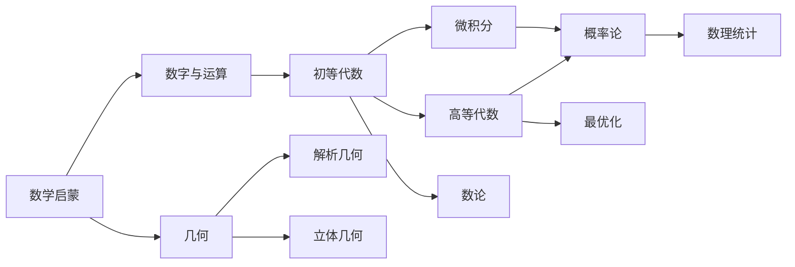

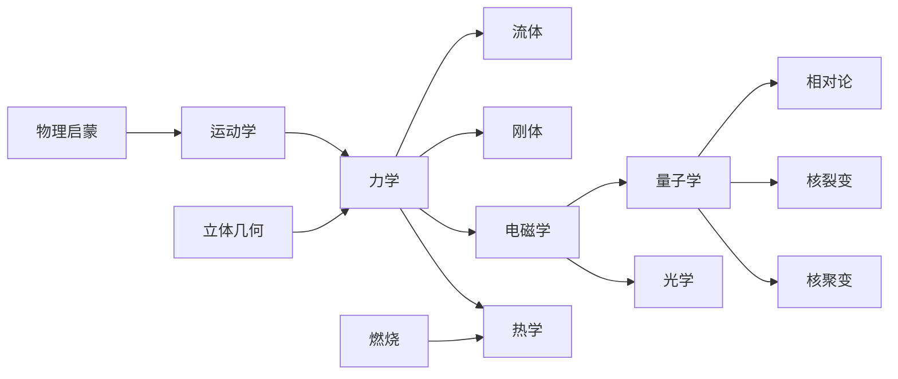

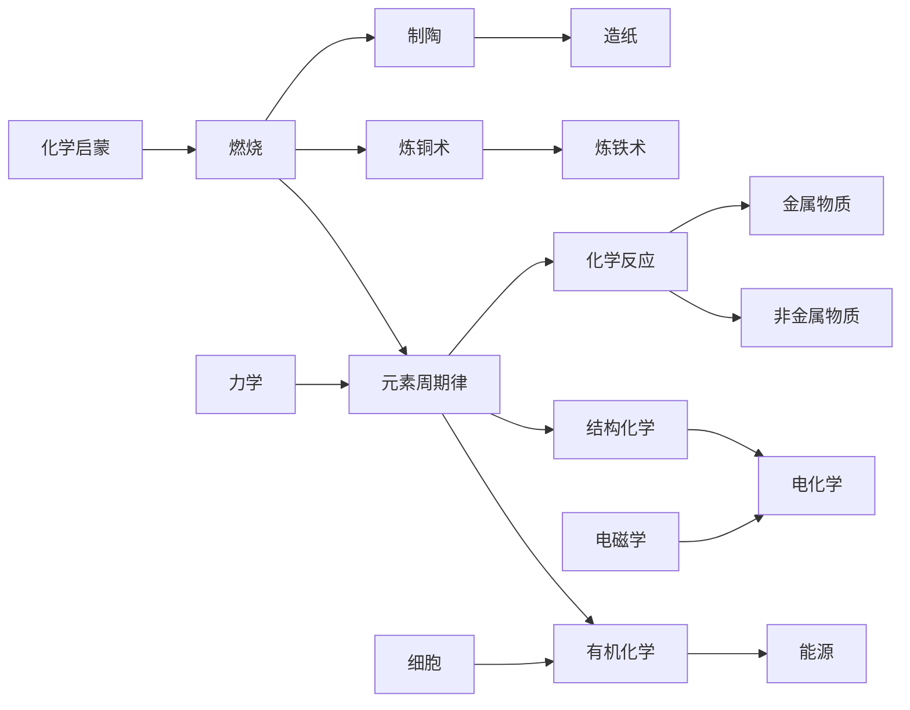

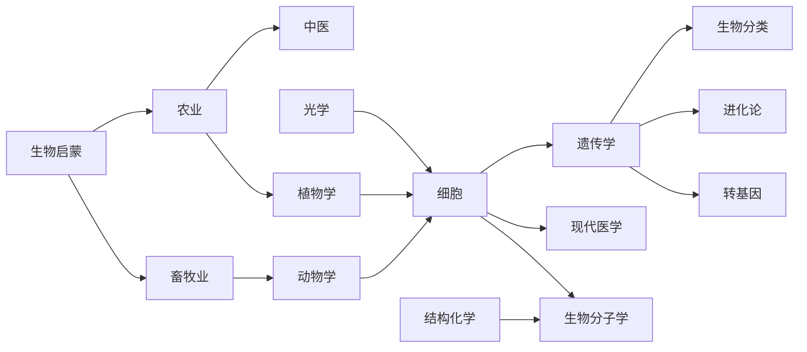

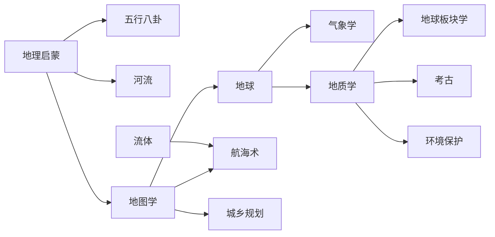

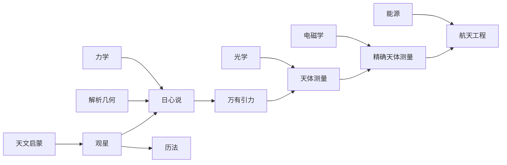

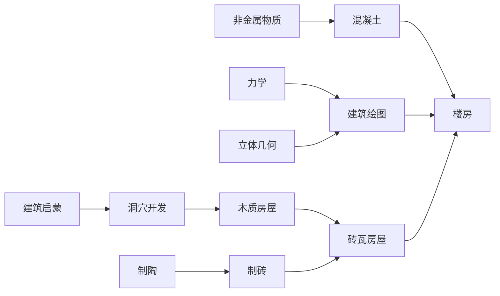

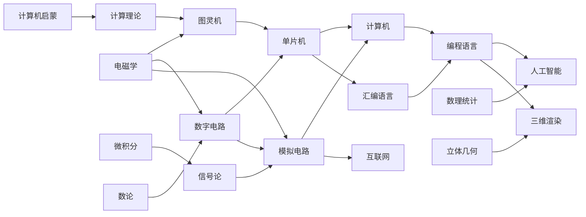

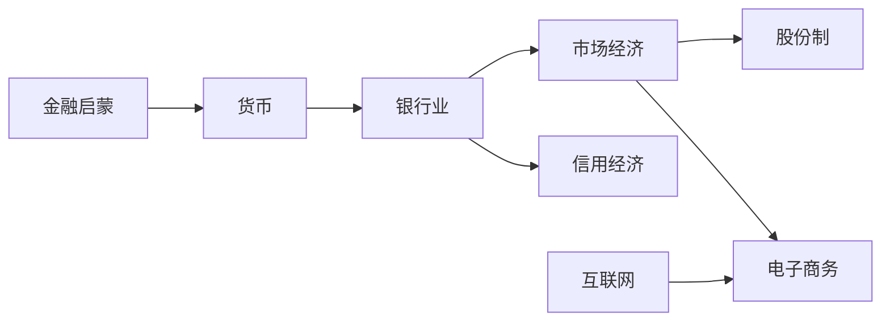

## 军队

### 兵种

攻击

防御

生命

暴击率

暴击伤害

频率

移动速度

#### 步兵

石槌兵->青铜剑士->铁剑士->长矛兵->步枪兵->机枪兵->机械步兵->装甲车->火焰战车

#### 骑兵

骑手->青铜骑士->铁骑士->轻骑兵->重骑兵->轻型坦克->重型坦克->光棱坦克->未来机甲

#### 炮兵

投石兵->弓箭手->弩手->火枪手->投弹兵->火炮->野战炮->火箭炮->激光炮

#### 海军

木筏->木舟->桨帆船->重型帆船->炮艇->驱逐舰->战列舰->航空母舰->核潜艇

#### 空军

飞鸽->鹰->羽人->滑翔翼->热气球->双翼机->喷气式飞机->重型空艇->空中要塞

#### 阵地

石垒->铜台->箭塔->巨石塔->火枪塔->炮塔->重机枪塔->榴弹炮塔->红外卫星塔

### 属性加持

####石块

金：硬度增强，增加伤害

木：无

水：水雾弥散，降低防御

火：表面燃烧，持续伤害

土：石块崩裂，扩散伤害

#### 铜刃

金：硬度增强，增加伤害

木：弹性优化，增加频率

水：氧化感染，持续伤害

火：高温灼烧，持续伤害

土：无

#### 铁刃

金：硬度增强，增加伤害

木：无

水：氧化感染，增加暴率

火：高温灼烧，增加暴伤

土：物质化合，增加伤害

#### 铁弹

金：硬度增强，增加伤害

木：荆棘迸裂，扩散伤害

水：无

火：强化炸裂，扩散伤害

土：强化炸裂，扩散伤害

#### 炸弹

金：硬度增强，增加伤害

木：促进燃烧，持续伤害

水：高温蒸汽，扩散伤害

火：高温灼烧，增加伤害

土：强化炸裂，扩散伤害

#### 子弹

金：硬度增强，增加伤害

木：附着毒素，持续伤害

水：润滑加速，增加频率

火：高温灼烧，增加伤害

土：增加感染，降低防御

#### 榴弹

金：合金弹头，增加伤害

木：附着毒素，持续伤害

水：无

火：强化爆炸，增加伤害

土：强化爆炸，扩散伤害

#### 火焰

金：无

木：强化燃烧，增加暴率

水：高温蒸汽，扩散伤害

火：能量聚集，增加频率

土：飞沙走石，增加伤害

#### 激光

金：多维反射，扩散伤害

木：高温毒素，降低防御

水：折射聚光，增加暴伤

火：高温激光，增加伤害

土：无

#### 核弹

金：合金弹头，增加伤害

木：强化燃烧，增加伤害

水：充分冷却，增加频率

火：反应充能，增加伤害

土：元素反应，增加暴率

## 修炼

### 属性

#### 金

#### 木

#### 水

#### 火

#### 土

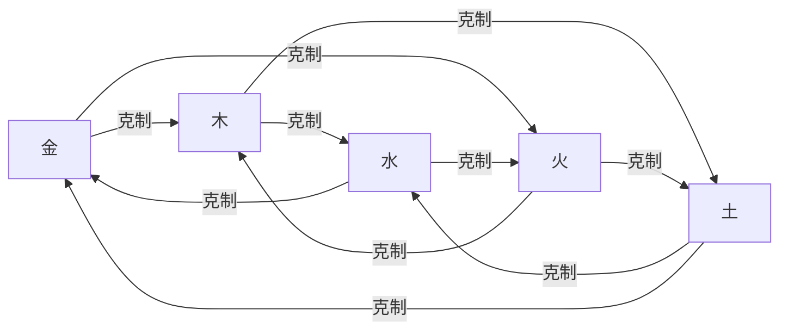

### 等级

#### 黄阶

无

#### 玄阶

无

#### 地阶

武技

金

木

水

火

土

#### 天阶

兵器

金

木

水

火

土

## 初始

### 人物

#### 5x

##### 羽奇（火）

数学5x

物理4x

##### 凌菲儿（水）

化学4x

文学4x

##### 落叶（木）

数学3x

物理2x

计算机5x

##### 望海（水）

法律4x

历史4x

化学1x

##### 芊千（土）

数学1x

天文5x

建筑2x

##### 高乐高（金）

历史5x

音乐4x

##### 云飞扬（火）

计算机3x

地理2x

美术3x

##### 可歆（土）

数学5x

法律2x

金融2x

##### 天杰（金）

物理5x

语言4x

##### 贝塔（木）

建筑4x

化学3x

文学3x

#### 4x

##### 都督（金）

生物5x

历史1x

金融1x

##### 秋香（木）

语言4x

文学2x

金融1x

##### 长空（火）

金融4x

建筑1x

文学1x

##### 雪月（土）

地理2x

美术4x

文学1x

##### 鸢尾狐（木）

地理5x

法律2x

##### 星尘（火）

建筑4x

计算机1x

数学1x

##### 洪兴（水）

物理2x

化学2x

生物2x

##### 冷锋（水）

生物5x

历史1x

#### 3x

##### 飞科（土）

计算机1x

金融1x

法律1x

历史1x

##### 周易（金）

金融4x

地理1x

##### 风行（土）

数学5x

##### 麻花藤（木）

化学4x

##### 浩南（水）

建筑4x

物理1x

##### 子夜（金）

语言2x

文学2x

#### 2x

##### 北辰（火）

数学2x

语言1x

##### 江沿（水）

天文3x

##### 惜扬（木）

计算机1x

文学1x

##### 良辰（金）

物理2x

#### 1x

##### 日月明

建筑1x

##### 糖塘

语言1x

### 物品

植物种子

动物幼崽

小型武器

理论书籍

## 养成

### 人物等级

#### 天

#### 地

#### 玄

#### 黄

### 武技等级

1-20层

### 兵器等级

1-20阶

### 装备等级

1-20级

## 家园

### 采集产品

#### 有机物

#### 无机物

### 收获产品

#### 作物

1. 小麦
2. 水稻
3. 玉米
4. 萝卜
5. 茄子
6. 大豆
7. 甘蔗
8. 棉花
9. 土豆
10. 辣椒
11. 南瓜
12. 番茄
13. 西瓜
14. 花生
15. 茶叶

#### 动物

1. 鸡
2. 牛
3. 猪
4. 羊
5. 鸭

#### 池塘

1. 鱼
2. 虾
3. 蟹
4. 贝

#### 果树

1. 苹果
2. 桃子
3. 柠檬
4. 香蕉
5. 樱桃
6. 葡萄
7. 可可
8. 咖啡
9. 橡胶

#### 花卉

1. 狗尾草
2. 蒲公英
3. 玫瑰
4. 兰花
5. 郁金香
6. 薰衣草
7. 茉莉
8. 金银花

### 工厂产品

#### 木材厂

1. 木柴
2. 锄头
3. 梯子
4. 木板
5. 木筏
6. 纸

#### 磨坊与烘焙坊

1. 面粉
2. 面包
3. 饼干
4. 蛋糕
5. 米粉
6. 披萨饼皮
7. 面条
8. 饺子皮

#### 动物饲料厂

1. 鸡饲料
2. 牛饲料
3. 猪饲料
4. 羊饲料
5. 鸭饲料

#### 乳制品厂

1. 奶油
2. 奶酪
3. 黄油
4. 沙拉酱
5. 酸奶

#### 调料厂

1. 醋
2. 酱油
3. 白糖
4. 豆瓣酱
5. 糖浆
6. 辣酱
7. 番茄酱
8. 花生酱

#### 纺织厂

1. 棉布
2. 毛线
3. 绷带
4. 织布
5. 丝绸
6. 渔网

#### 花束加工厂

1. 玫瑰束
2. 盆栽
3. 混合花束
4. 香水
5. 金银花瓣

#### 服装厂

1. 衬衫
2. 毛衣
3. 布鞋
4. 西装
5. 羽绒服
6. 运动鞋
7. 礼服
8. 背包
9. 铠甲
10. 头盔

#### 建筑工厂

1. 石块
2. 平房
3. 别墅
4. 砂砾
5. 凉亭
6. 沥青
7. 公园
8. 公寓

#### 熟食品加工厂

1. 培根
2. 豆腐
3. 牛排
4. 火腿
5. 爆米花
6. 巧克力
7. 冰淇淋

#### 装饰品作坊

1. 南瓜灯
2. 彩旗
3. 拱门
4. 花篮
5. 圣诞树
6. 气球
7. 雕像

#### 饮料厂

1. 啤酒
2. 柠檬水
3. 混合果汁
4. 西瓜汁
5. 美式咖啡
6. 奶茶

#### 重工业加工厂

1. 煤炭
2. 塑料
3. 铁锭
4. 石墨
5. 金条
6. 火箭零件

#### 军工厂

1. 石剑
2. 铜剑
3. 铁剑
4. 弓箭
5. 炸药
6. 手枪
7. 冲锋枪
8. 意大利炮
9. 火焰枪
10. 坦克 
11. 飞行器
12. 激光枪
13. 核弹

#### 首饰作坊

1. 钻石戒指
2. 项链
3. 手镯
4. 耳环
5. 金钗

#### 

## 道具

### 养成

#### 发展

理论书籍

解梦

#### 军队

召集令

超载元件

#### 修炼

玉佩

雪莲

树晶

天参

### 使用

#### 矿物

铝

锌

钨

硅

金刚石

黄金

#### 工厂产物

工具

食物

衣物

建筑

武器原胚

装饰

奢侈品

#### 采集物

大蒜

木耳

蘑菇

小龙虾

莲藕

糯米

田螺

花椒

香叶

海带

鲍鱼

蜂蜜

生菜

#### 料理

##### 5x

佛跳墙

北京烤鸭

夫妻肺片

粉丝扇贝

红烧鲍鱼

奶香虾球

酱爆田螺

雪花肥牛

##### 4x

锅贴

芝士肉酱意面

松鼠鱼

海鲜披萨

粉蒸肉

醉蟹

巧克力冰淇淋

秘制唐扬串

正新鸡排

涮羊肉

卤味烧麦

蛋黄焗南瓜

##### 3x

海鲜蒸蛋羹

虾仁肠粉

奶油蛋糕

黄焖鸡

糯米藕

红烧肉

西湖醋鱼

香辣蟹

毛血旺

水晶饺

芝士玉米土豆泥

扬州炒饭

过桥米线

浙大大鸡腿

烤面筋

老北京鸡肉卷

##### 2x

干烧鱼

蛋黄肉粽

东坡肘子

干煸藕丝

牛肉粉丝汤

奶油爆米花

炸春卷

酸菜鱼

小鸡炖蘑菇

煎饼果子

酱牛肉

三明治

灌汤小笼包

牛肉面

罗宋汤

广式菠萝包

干炒牛河

火腿寿司

凉拌西红柿

韩式炒年糕

##### 1x

番茄炒蛋

酸辣土豆丝

烤冷面

狮子头

腊汁肉夹馍

拌三丝

鸡丝凉面

油炸花生米

薯条

北京炸酱面

糖醋里脊

铜锣烧

五香茶叶蛋

麻婆豆腐

白斩鸡

拔丝土豆

香脆茄夹

培根煎蛋

皮蛋瘦肉粥

鱼香肉丝

蛋炒饭

地三鲜

东北大拌

小热狗

#### 兵器附魔

金刚

檀木

清津

炽焰

磐符

#### 丹药

聚气

## 地图

### 城市

#### 主城区

##### 市场

##### 研究院

##### 军营

##### 武馆

#### 郊区

##### 常驻

乡间别墅：商人

深林居：修炼者

##### 一次性

帮派：修炼者

叛军兵营：军队

高危险境：魔物

### 区域划分

#### 呼伦贝尔（木）

##### 满洲里

##### 齐齐哈尔

#### 小兴安岭（木）

##### 哈尔滨

##### 佳木斯

##### 大庆

#### 东北（土）

##### 沈阳

##### 长春

##### 长白山

#### 华北（木）

##### 青岛

##### 淮南

##### 南阳

##### 洛阳

#### 长江三角洲（水）

##### 杭州

##### 上海

##### 温州

#### 蒙古（金）

##### 乌海

##### 包头

##### 呼和浩特

#### 黄土高坡（土）

##### 西安

##### 太原

#### 西川（火）

##### 重庆

##### 成都

#### 云贵（金）

##### 昆明

##### 贵阳

##### 普洱

#### 洞庭湖（水）

##### 长沙

##### 武汉

##### 荆州

##### 衡阳

#### 江南（水）

##### 南京

##### 芜湖

##### 黄山

#### 闽南（木）

##### 福州

##### 南昌

##### 厦门

#### 塔里木（火）

##### 轮台

##### 铁门关

#### 阿拉善（土）

##### 银川

##### 酒泉

#### 天山山脉（金）

##### 乌鲁木齐

##### 哈密

#### 青藏高原（金）

##### 拉萨

#### 珠江三角洲（水）

##### 广州

##### 香港

##### 湛江

#### 台湾（火）

##### 台北

##### 高雄

##### 新竹

#### 海南（水）

##### 三亚

##### 海口

